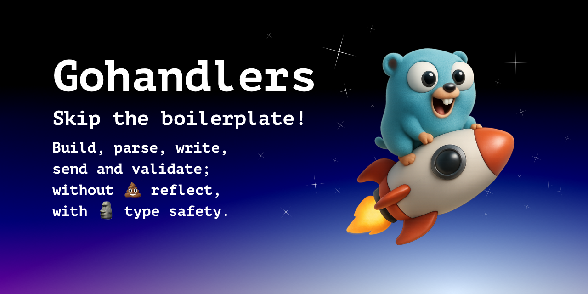
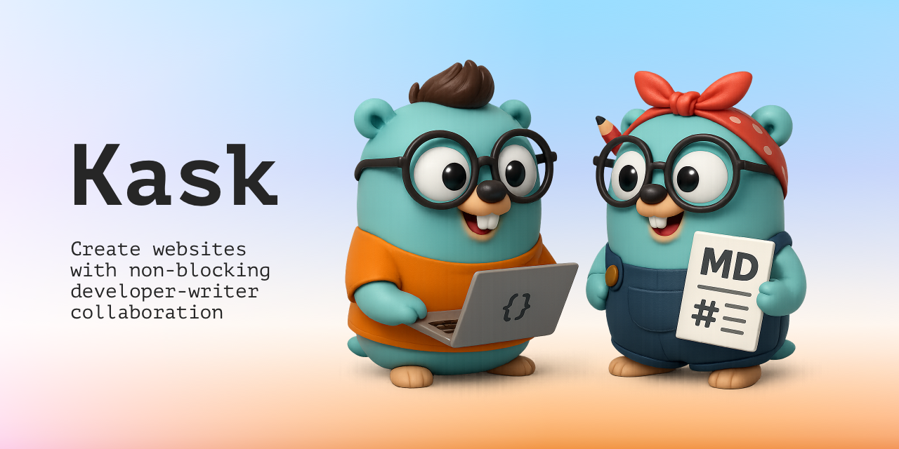
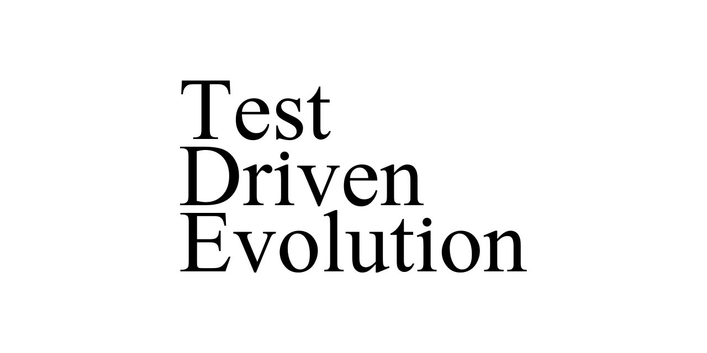

# Showcase

I mainly publish developer tools for Go and Visual Studio Code. There are also homework submissions from the last decade.

## Gohandlers

Generate code for strongly typed and reflectionless request-response binding, request validation, registering routes and Go clients.

## Kask

A static website generator allows developer-writer collaboration without synchronization.

## Bump

Smallest compiled CLI utility bumps with one command.

## Gonfique Playground

Brings Gonfique to browsers.

## Gonfique

Customizable and offline YAML and JSON to Go for config files.

## Dim

A Visual Studio Code extension lets you define regex rules to dim boring parts of code and make the main logic pop.

## TDE

Tooling for finding test-passing Go code using Genetic Programming.

## Reddit Galaxy

Visualization of the links between subreddits.

## Diffusion of Innovation simulation

Simulates the spread of hypothetical innovation throughout from its genesis to total market domination to observe S-curve phenomenon and the influence of populars on communities with varying topologies.

## Ball and Stick Man

A basic 3D demonstration with a movable camera, animated arms, a “tour” mode, and waving interactions.

## Poor Man's Social Media

Social network backend and frontend. Written with JS and PHP demonstrating connection status manipulation and asynchronous API calls.
